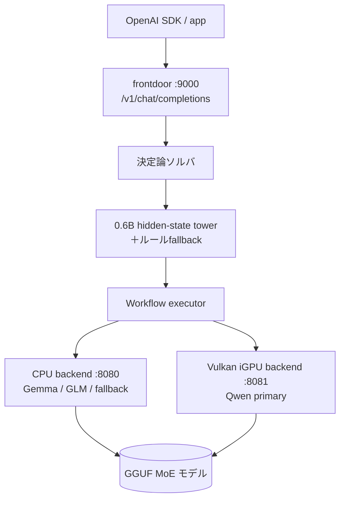

<div align="center">

# open-Fugu

### ディスクリートGPU不要・64GB RAMミニPCで動く逐次型 MoE-of-MoEs コンダクタ

[](manifest.json)
[](requirements.txt)
[](scripts/start_llama_router_minipc.ps1)
[](examples/client_test.py)
[](LICENSE)

**Sakana Fugu風の「複数モデル協調」を、ディスクリートGPUなしの 64GB RAM 機で成立させるわよ。**

---

</div>

## 概要

`open-Fugu`（実体名: `local-moe-fugu-7940hs`）は、Windows 11 + AMD Ryzen 9 7940HS + 64GB DDR5 のミニPC上で、3つの MoE 系 GGUF モデルを **llama.cpp router server + 自作 Conductor** で切り替えて使うための設計・実装です。

並列討論型で全モデルを同時常駐させるのではなく、1モデルずつホットロードして役割分担する **sequential MoE-of-MoEs** を前提にしています。frontdoor は OpenAI 互換 (`/v1/chat/completions`) なので、既存の OpenAI SDK からそのまま叩けます。

## 特徴

| 機能 | 内容 |
|---|---|
| 逐次協調 | Gemma → Qwen → GLM を逐次ホットロードし、役割非対称で協調させる（同時常駐・多数決はしない） |
| 4モード | `fast` / 通常 / `deep` / `ultra` を1つのモデル名で切り替え |
| 0.6B router | Qwen3-0.6B の hidden state + seed head で agent/mode/task を推定。失敗時は決定的ルールへ安全にフォールバック |
| 決定論ショートカット | 日付・算術・文字数カウント等はモデルを呼ばず即返答 |
| 検証→修復ループ | risky タスクのみ GLM が検証し、major defect なら Qwen が修復 |
| OpenAI 互換 | `/v1/chat/completions` ・streaming 対応（内部 draft は流さず final のみ SSE） |
| tool 実行（オプトイン） | `fugu_tools` 指定時のみ pytest / ruff / tsc 等を実行し、失敗ログ起点で修復 |
| ハイブリッド backend (v0.7.9) | Qwen primary は AMD Radeon 780M の Vulkan backend (:8081)、Gemma/GLM・fallback は CPU backend (:8080) に分離。プロセスは High priority、`--poll` は既定なし |

## モデル役割

| 役割 | モデル | 用途 |
|---|---|---|
| Planner / Synthesizer | Gemma 4 26B A4B | 公開仕様化、構成整理、日本語長文、最終整形 |
| Primary Worker | Qwen3.6 35B A3B | 実装、デバッグ、手順分解、コード、リポジトリ推論 |
| Verifier / Critic | GLM-4.7-Flash | 検証、批判、矛盾検出、修復指示 |

## 対象ハードウェア

| 項目 | スペック |
|---|---|
| OS | Windows 11 Pro Build 26200 |
| CPU | AMD Ryzen 9 7940HS, 8C/16T |
| iGPU | AMD Radeon 780M（Vulkan backend で Qwen primary を実行） |
| RAM | 64GB DDR5-5600 |
| SSD | 1TB NVMe |

> Q4 級の重みは Gemma 約17GB + Qwen 約22GB + GLM 約19GB ≒ 58GB。64GB で3体同時常駐は危険なため、`--models-max 2` ＋ Conductor 側 lock で逐次呼び出しにしている。v0.7.9 では Qwen primary を iGPU(Vulkan :8081)、Gemma/GLM・fallback を CPU(:8080) に振り分けるハイブリッド構成を本番採用。

## 処理フロー



| モード | フロー |
|---|---|
| `:fast` | route → primary answer |
| 通常 | route → primary answer → risky なら GLM 検証 |
| `:deep` | Gemma 仕様化 → Qwen 回答 → GLM 検証 → 必要なら Qwen 修復 |
| `:ultra` | Gemma → Qwen → GLM → Gemma synthesis → GLM final → 必要なら修復 |

## インストール

```powershell
cd C:\llm\local-moe-fugu-7940hs
powershell -ExecutionPolicy Bypass -File .\scripts\setup_windows.ps1
```

モデル重み（`*.gguf`）はリポジトリに含めません。`C:\llm\models\` に配置してください。

## 使い方

PowerShell を2つ開く想定です。

```powershell
# 1) llama.cpp router server 起動
powershell -ExecutionPolicy Bypass -File .\scripts\start_llama_router_minipc.ps1 -StopExisting

# 2) frontdoor 起動
powershell -ExecutionPolicy Bypass -File .\scripts\start_frontdoor_minipc.ps1

# 3) 動作確認
powershell -ExecutionPolicy Bypass -File .\scripts\smoke_test.ps1
python .\examples\client_test.py
```

呼び出すモデル名:

```text
local-moe-fugu        # 通常。Primary 1回 + risky なら検証。
local-moe-fugu:fast   # 1モデル直行。
local-moe-fugu:deep   # Gemma仕様化 → Qwen回答 → GLM検証 → 必要なら修復。
local-moe-fugu:ultra  # Gemma → Qwen → GLM → Gemma → GLM。遅い。
```

SSH 越しに常駐させる場合は、Scheduled Tasks に長時間プロセスを持たせる [`restart_fugu_stack_user.ps1`](scripts/restart_fugu_stack_user.ps1) を使う（起動後に Gemma/Qwen ウォームアップまで実施。`-SkipWarmup` でスキップ可）。

詳細な設計・運用は [`docs/`](docs/) を参照（[`ARCHITECTURE.md`](docs/ARCHITECTURE.md) / [`MINIPC_RUNBOOK.md`](docs/MINIPC_RUNBOOK.md) / [`MODEL_SELECTION.md`](docs/MODEL_SELECTION.md)）。

## 現行構成 (v0.7.9)

| 項目 | 値 |
|---|---|
| frontdoor | `:9000`（OpenAI 互換 / `/health` / `/fugu/capabilities`） |
| CPU backend | `:8080` = Gemma / GLM / fallback（b9784） |
| Vulkan iGPU backend | `:8081` = Qwen primary（b8992、Radeon 780M、`-ngl 99`） |
| 0.6B 管制塔 | loaded（Qwen3-0.6B hidden state routing） |
| プロセス優先度 | High priority、`--poll` は既定なし（end-to-end ベンチで Poll50/Poll100 を上回ったため） |
| 検証用 | [`run_vulkan_trial.ps1`](scripts/run_vulkan_trial.ps1)（iGPU/Vulkan ベンチ。常駐ランチャーではない） |

## Attribution

設計思想は Sakana AI の Fugu 系「複数モデル協調」から着想を得ていますが、本リポジトリは独立実装です。バックエンドに [llama.cpp](https://github.com/ggml-org/llama.cpp) の router server を利用します。

## ライセンス

[MIT License](LICENSE) — Copyright (c) 2026 cUDGk
